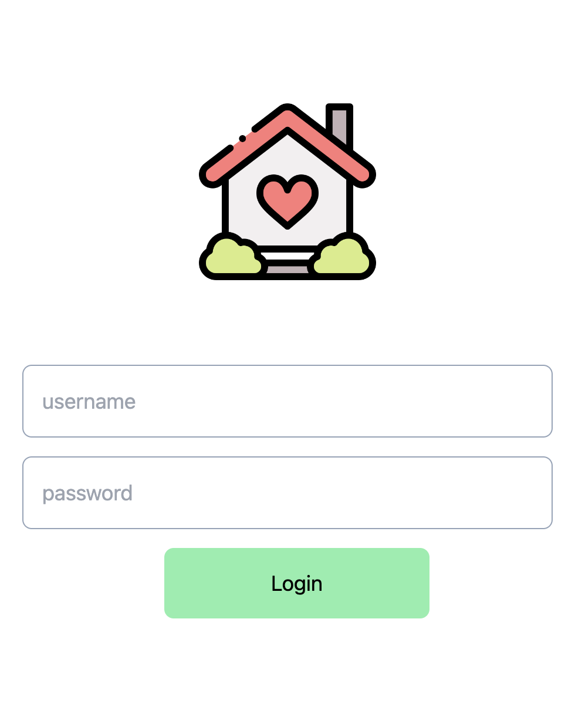
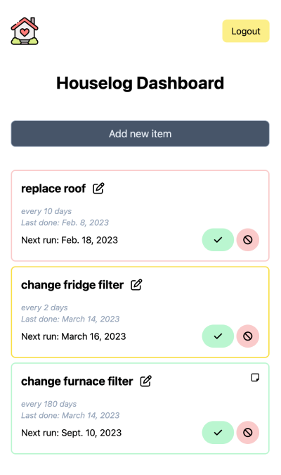

# Houselog

A simple tracking system for house-related tasks

Includes:
- frequency tracker
- email reminder (WIP)
- notes (like furnace filter size, or fridge model, etc)

<table>
<tr>
<td style="vertical-align:top">
    
</td>
<td>
    
</td>
</tr>
</table>

### Usage

```
mv .env.example .env
vim .env
docker-compose build
docker-compose up
```
